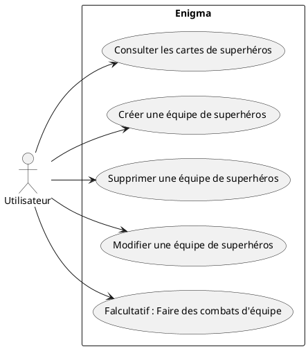

# Usecase

```puml
@startuml
left to right direction

actor "Utilisateur" as U

rectangle Enigma {
    usecase "Consulter les cartes de superhéros" as co
    usecase "Créer une équipe de superhéros" as cr
    usecase "Supprimer une équipe de superhéros" as sup 
    usecase "Modifier une équipe de superhéros" as mod
    usecase "Falcultatif : Faire des combats d'équipe" as com
}

U --> co
U --> cr
U --> sup 
U --> mod
U --> com


@enduml

```

> The goal is to implement a CRUD system